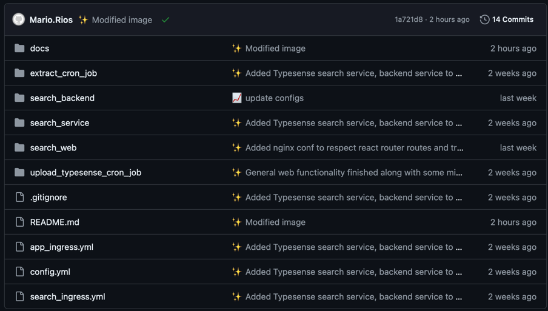

# Tracky - Proyecto de Cloud Computing - Plataforma para el seguimiento de precios de celulares en Falabella y Entel

## Integrantes

| Nombre | Código | Rol |
| ------ | ------ | --- |
| Jose Huby | 201810178 | Data Engineer / Backend Engineer  |
| Luis Berrospi | 201910359 | Frontend Engineer / Scrum Master |
| Mario Rios | 201910285 | Data Engineer / DevOps Engineer |

## Demostración del proyecto

Una demostración del proyecto se encuentra disponible en el siguiente [link](http://34.128.189.73).

## Gestión de Proyecto

Toda la gestión del proyecto se realizará utilizando la plataforma Jira, en la cual se llevará un control de las tareas a realizar, los tiempos de entrega y el estado de cada tarea. Adicionalmente, se realizarán reuniones semanales para evaluar el avance del proyecto y los problemas que se presenten.

## Gestión de Código

Todo el código del proyecto se encuentra alojado en el repositorio de GitHub del proyecto. Cada subcarpeta contiene el código de cada componente de la aplicación y adicionalmente, según aplique, los archivos YAML correspondientes al despliegue de los servicios y deployments en Kubernetes. Aparte de ello, en la raíz también se encuentran los archivos YAML correspondientes a los objetos ingress. Componentes sensibles se encuentran ignorados en el archivo `.gitignore`.

## Descripción de aplicación

Actualmente, debido a las múltiples fechas festivas, existe desinformación sobre donde encontrar los precios más bajos para ciertos artículos, en especial, de celulares. Para facilitar tener un histórico del comportamiento de estos artículos planteamos la creación de un sitio dedicado a mostrar el histórico y la evolución de las compras y los precios de los celulares. Por motivos prácticos, tomaremos como fuente la página de Falabella y Entel, ya que son dos de las tiendas más grandes en el mercado peruano.

## Ejecución de la aplicación

La aplicación web contará con un buscador que permitirá indexar los celulares de Falabella y Entel. Luego de ello, el usuario podrá entrar a la página de especificaciones de un celular y visualizar el histórico de precios.

## Referencias

En el mercado se han visto soluciones parecidas para ayudar a los consumidores finales a escoger el menor precio posible para los dispositivos. Por ejemplo, tenemos el caso de la página compy.pe que realiza un procedimiento similar con más proveedores de información como Promart, Mercado Libre, etc.
El impacto de este tipo de iniciativas es alto, situandose incluso como los principales canales de tráfico para las tiendas online. De acuerdo a la misma página, compy.pe se registra como uno de los principales canales de tráfico tiendas como Falabella, Ripley, La Curacao, entre otros. La fuente de esta información se encuentra en el siguiente [link](https://www.linkedin.com/feed/update/urn:li:activity:6965877213497810944/).