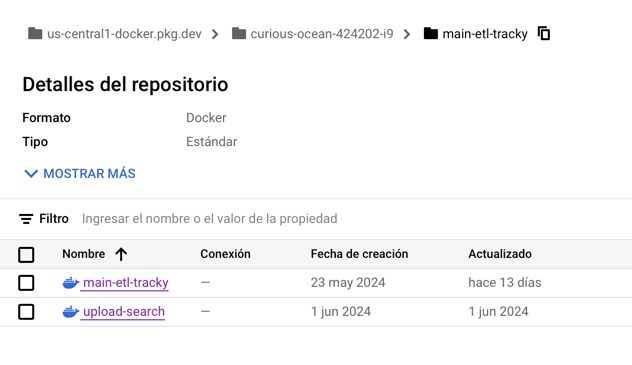
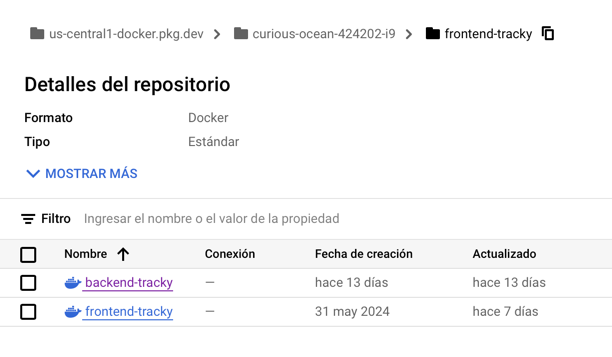
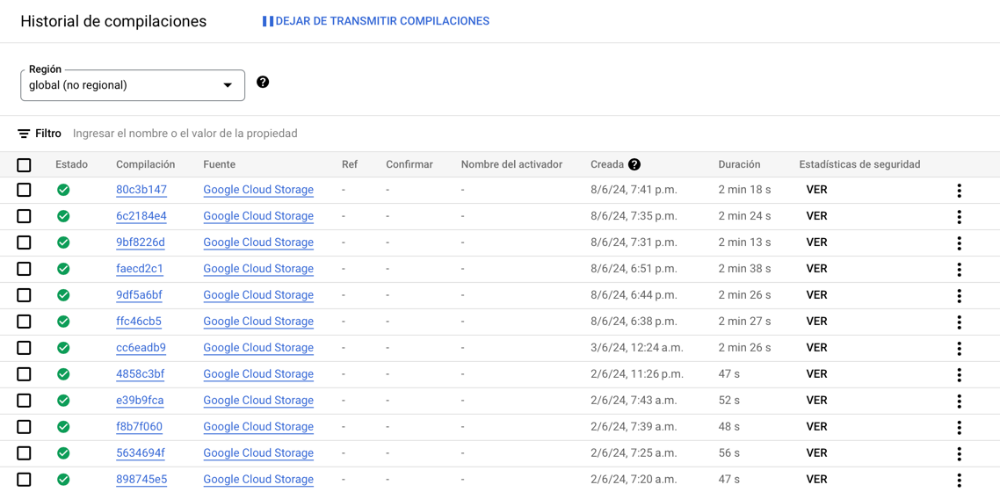

# Artifact Registry

Artifact Registry es un servicio de Google Cloud Platform que permite almacenar, gestionar y distribuir imágenes de
contenedores. En este caso, se utilizará Artifact Registry para almacenar las imágenes de los contenedores de la
aplicación web.

Para ello se tienen 2 repositorios:

### main-etl-tracky

Este contiene 2 imágenes:

- `main-etl-tracky`: Imagen del cronjob que se encarga de la extracción, transformación y carga de información en la
  base
  de datos.
- `upload-search`: Imagen del cronjob que se encarga de la carga de información en el servicio de búsqueda de Typesense.

### frontend-tracky

Este contiene 2 imágenes:

- `backend-tracky`: Imagen de la aplicación backend.
- `frontend-tracky`: Imagen de la aplicación frontend.

# Cloud Build

Cloud Build es un servicio de Google Cloud Platform que permite automatizar la construcción de artefactos. En este caso,
se utilizará Cloud Build para construir las imágenes de los contenedores de la aplicación web y de los cronjobs, para
finalmente almacenarlas en Artifact Registry.

Esto se realiza a través de la interfaz de comandos de Google Cloud (gcloud) y de los archivos Dockerfile de cada
subproyecto.
