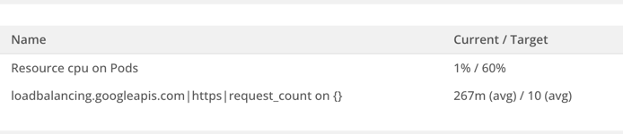
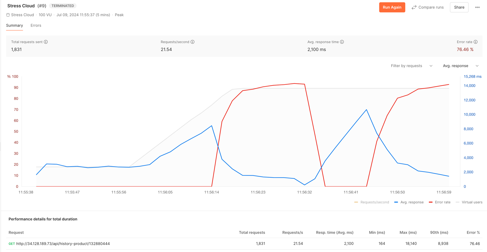

# Escalamiento Horizontal

Para el escalamiento horizontal, se trabajó principalmente con el deployment del backend.
Esto debido a que era el que interactuaba directamente con la base de datos.
Para ello, consideramos 2 métricas principales:

- Cantidad de peticiones por segundo
- Porcentaje de uso de CPU

Para comprobar el correcto funcionamiento de la escalabilidad horizontal, se realizó una prueba de carga con la
herramienta `Postman`. Donde se simularon 100 usuarios con un comportamiento de búsqueda del tipo `Peak`, es decir, con
una alta frecuencia de peticiones en un corto periodo de tiempo.

