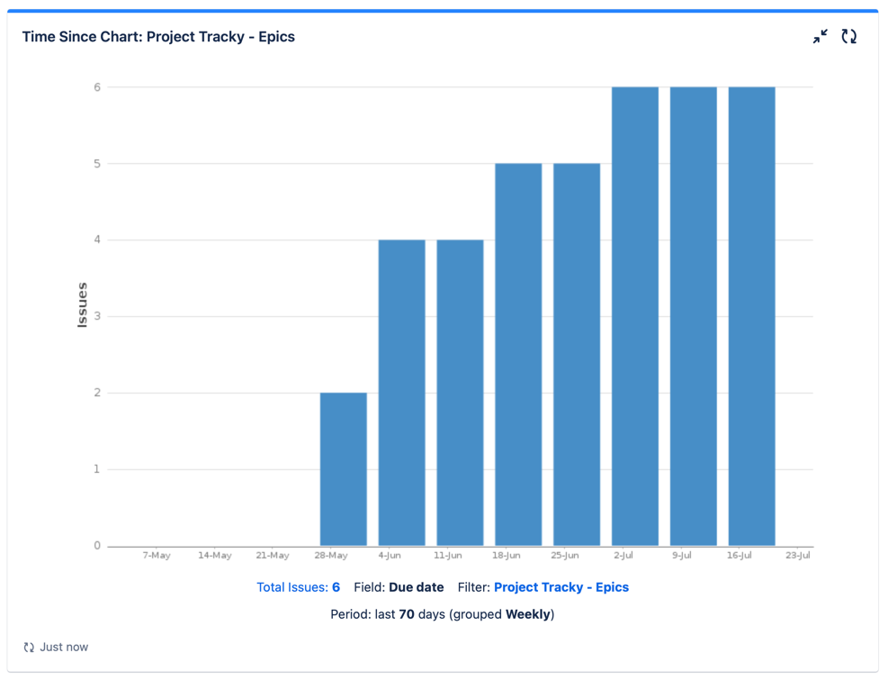
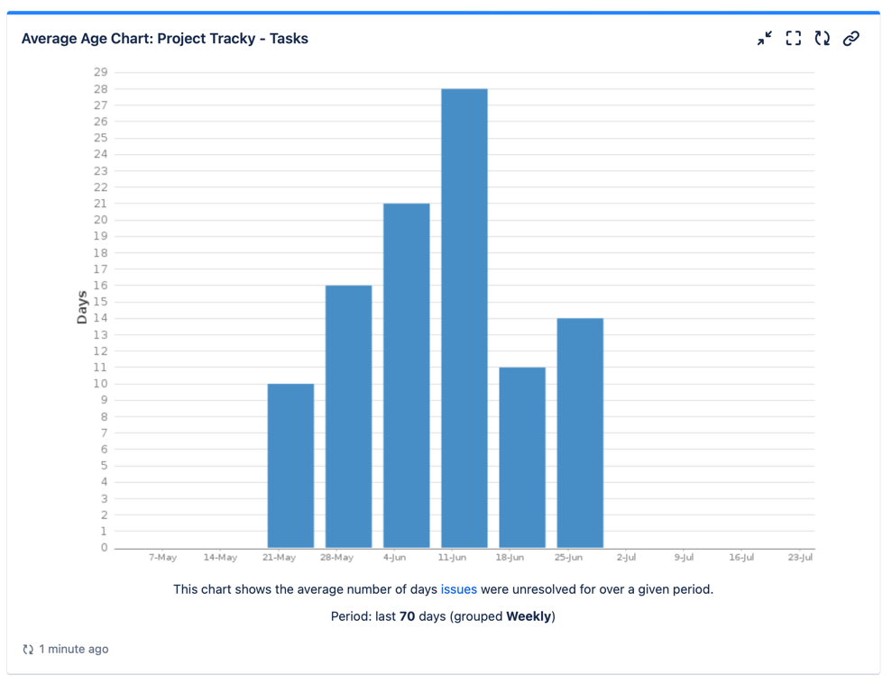
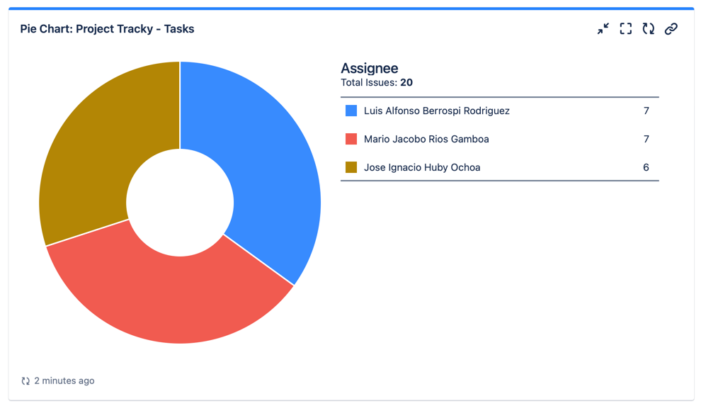

# Reportes de Jira

## Reporte de finalización de épicas

Muestra el tiempo acumulativo por semana en el que se completaron las épicas del proyecto. Que en este caso fueron 3 épicas.

## Reporte de tiempo de solución para las tareas

Muestra el tiempo promedio por semana en el que se completaron las tareas del proyecto.

## Reporte de asignación de tareas

Muestra la cantidad de tareas que fue asignada a cada miembro del equipo.
