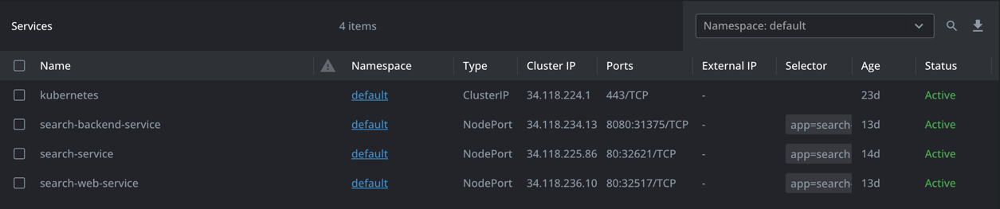
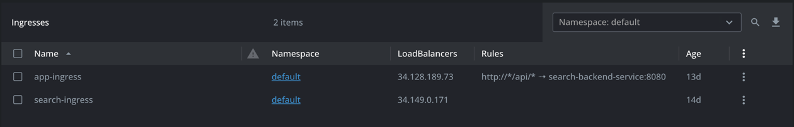

# ConfigMaps

### app-config

Contiene la configuración correspondiente a recursos no sensibles como: ip externa del buscador, key de búsqueda del
buscador y puerto del buscador.

# Secrets

### database-credentials

Contiene las credenciales de la base de datos PostgreSQL alojada en Vercel.

### typesense-key

Contiene la key administrativa del servicio de búsqueda de Typesense.

# Cronjobs

### main-etl

Este cronjob es el encargado de ejecutar el proceso de extracción, transformación y carga de información en la base de
datos. El cronjob `main-etl` se ejecuta diariamente a las 07:00 pm hora local. Este a su vez emplea el
secret `database-credentials`.

### upload-search

Este cronjob es el encargado de ejecutar el proceso de carga de información en el servicio de búsqueda de Typesense. El
cronjob `upload-search` se ejecuta diariamente a las 10:00 pm hora local. Este a su vez emplea los
secrets `typesense-key` y `database-credentials`, y el configmap `app-config`.

# Deployments

### search-backend-deployment

Este deployment es el encargado de desplegar el servicio de backend de la aplicación. El servicio de backend es el
encargado de gestionar las peticiones de los usuarios y de interactuar con la base de datos para obtener la información
del historial de precios. Se emplea una imagen personalizada alojada en Artifact Registry y se toman las credenciales de
un Secret y
las configuraciones de un ConfigMap.
Al momento del desarrollo y construcción de la aplicación, el deployment `search-backend-deployment` cuenta
con 1 réplica.

### search-deployment

Este deployment es el encargado de desplegar el servicio de búsqueda de Typesense. Este servicio recibe su información a
través del proceso de carga de información y permite a los usuarios buscar celulares por nombre o marca.
Se emplea la imagen oficial de Typesense 26.0 y se toman las credenciales de un Secret. A momento del desarrollo y
construcción de la aplicación, el
deployment `search-deployment` cuenta con 1 réplica.

### search-web-deployment

Este deployment es el encargado de desplegar el servicio web de la aplicación. El servicio web es el encargado de
mostrar la interfaz de usuario de la aplicación y de interactuar con el servicio de backend y el servicio de búsqueda
para obtener la información necesaria. Se emplea una imagen personalizada alojada en Artifact Registry y se toman las
configuraciones de un ConfigMap. Al momento del desarrollo y construcción de la aplicación, el
deployment `search-web-deployment` cuenta con 1 réplica.

# Services

### search-service

Este servicio es el encargado de exponer el servicio de búsqueda de Typesense. Es del tipo NodePort y mapea el puerto
del contenedor (8108) al puerto del nodo.

### search-web-service

Este servicio es el encargado de exponer el servicio web de la aplicación. Este servicio es del tipo NodePort y mapea el
puerto del contenedor (80) al puerto del nodo.

### search-backend-service

Este servicio es el encargado de exponer el servicio de backend de la aplicación. Este servicio es del tipo NodePort y
mapea el puerto del contenedor (8080) al puerto del nodo.

# Ingress

### app-ingress

Este recurso de Kubernetes es el encargado de exponer los servicios de backend y frontend al exterior. Este contiene 2
sub-rutas que son `/` y `/api`. La primera ruta corresponde al Service `search-web-service` y la segunda ruta
corresponde al Service `search-backend-service`. Se emplea una dirección IP estática para el balanceador de carga.

### search-ingress

Este recurso de Kubernetes es el encargado de exponer el servicio de búsqueda de Typesense (Service `search-service`) al
exterior. Se emplea una dirección IP estática para el balanceador de carga.
