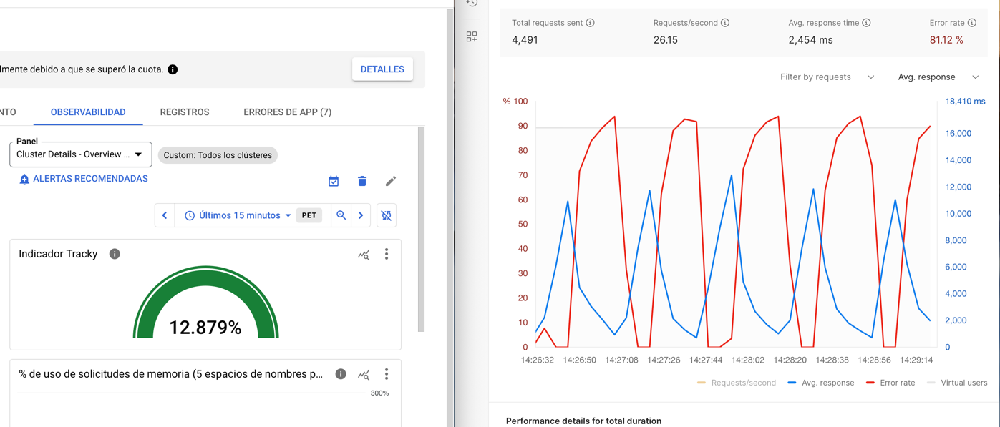

# Monitoreo

## Objetivo

Tener un indicador que nos permita identificar la salud general de los servicios del Clúster de Kubernetes.

## Problema

No podemos depender solamente de indicadores como el uso de CPU o memoria para determinar la salud de los servicios.
Pues, en nuestra aplicación se da el caso de que un servicio puede ser considerado saludable en términos de uso de CPU y
memoria, pero no es capaz de emitir consultas a la base de datos de manera exitosa a medida que crece el número de
usuarios. Esto puede deberse a problemas de red, problemas de latencia en la base de datos, entre otros.

## Solución

Consideramos una métrica compuesta que nos permita tener un indicador general de la salud de los servicios. Para ello,
consideramos las siguientes métricas:

- Porcentaje de uso de CPU (cpu_rate)
- Porcentaje de uso de memoria (memory_rate)
- Ratio de peticiones fallidas respecto al total de peticiones (error_rate)

La fórmula para calcular la métrica compuesta es la siguiente:

```shell
0.45 * cpu_rate + 0.1 * memory_rate + 0.45 * error_rate
```

Cómo se puede apreciar, el porcentaje de uso de CPU y el ratio de peticiones fallidas tienen un peso del 45% cada uno,
mientras que el porcentaje de uso de memoria tiene un peso del 10%. Esto se debe a que consideramos que el uso de CPU y
el ratio de peticiones fallidas son indicadores más críticos que el uso de memoria.

Para desplegar esta métrica, se utilizará el lenguaje QML de Google Cloud Monitoring. De esta manera, podremos manipular
y acceder
a las métricas de Google Cloud de manera sencilla.

Las métricas base, se extraerán de los siguientes recursos:

- cpu_rate: Métricas de uso de CPU de los contenedores de Kubernetes (core_usage_time/request_cores)
- memory_rate: Métricas de uso de memoria de los contenedores de Kubernetes (used_bytes/request_bytes)
- error_rate: Métricas de peticiones del balanceador de carga de Google Cloud (request_count)

Finalmente, se desplegará un gráfico en Google Cloud Monitoring que muestre la métrica compuesta en un rango de tiempo
En el siguiente bloque de código se muestra el script QML que se utilizará para desplegar la métrica compuesta.

```shell
{ { { fetch k8s_container
      | filter (resource.project_id == 'curious-ocean-424202-i9')
      | filter (resource.cluster_name == 'autopilot-cluster-1')
      | filter (resource.location == 'us-central1')
      | filter (resource.namespace_name == 'default')
      | { metric kubernetes.io/container/memory/used_bytes
        ; metric kubernetes.io/container/memory/request_bytes }
      | align next_older(2m)
      | group_by [resource.namespace_name], .sum()
      | outer_join 0
      | div
      | mul 0.1
    ; fetch k8s_container
      | filter (resource.project_id == 'curious-ocean-424202-i9')
      | filter (resource.cluster_name == 'autopilot-cluster-1')
      | filter (resource.location == 'us-central1')
      | filter (resource.namespace_name == 'default')
      | { metric kubernetes.io/container/cpu/core_usage_time
          | rate
          | every 1m
          | align next_older(2m)
        ; metric kubernetes.io/container/cpu/request_cores
          | align next_older(2m) }
      | group_by [resource.namespace_name], .sum()
      | outer_join 0
      | div
      | mul 0.45 }
    | join
    | add
    | cast_units ("") }
; { fetch https_lb_rule
    | metric 'loadbalancing.googleapis.com/https/request_count'
    | filter (metric.response_code_class == 500)
    | align next_older(2m)
    | every 1m
    | group_by [],
        [value_request_count_aggregate: aggregate(value.request_count)]
  ; fetch https_lb_rule
    | metric 'loadbalancing.googleapis.com/https/request_count'
    | align next_older(2m)
    | every 1m
    | group_by [],
        [value_request_count_aggregate: aggregate(value.request_count)] }
  | outer_join 0, 0
  | div
  | mul 0.45
  | cast_units ("") }
| join
| add
| cast_units("1")
| scale("%")
```

A continuación, se muestra el gráfico que se desplegará en Google Cloud Monitoring tanto en baja demanda como en alta
demanda simulando 100 usuarios:



Consideramos que un porcentaje por encima de 15% indica que los servicios están en riesgo de fallar. Por lo tanto, se
deberán tomar medidas correctivas para evitar que esto suceda.
