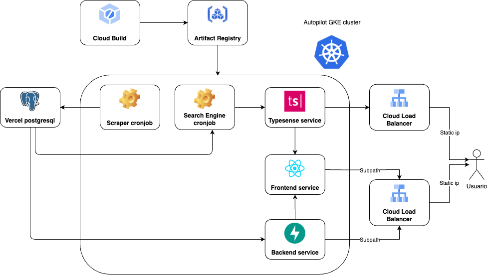

# Funcionalidades

La aplicación web permitirá a los usuarios visualizar el histórico de estadísticas de los celulares en Falabella. Para ello, se implementarán las siguientes funcionalidades:

- **Buscar celulares**: Los usuarios podrán buscar celulares por nombre o marca.
- **Visualizar histórico de precios y rating**: Los usuarios podrán visualizar el histórico de precios y rating de los celulares.

# Características

La aplicación web contará con las siguientes características:

- **Interfaz amigable**: La aplicación web contará con una interfaz amigable y fácil de usar.
- **Diseño responsivo**: La aplicación web será responsiva, es decir, se adaptará a cualquier dispositivo.
- **Latencia baja**: La aplicación web tendrá una latencia baja para una mejor experiencia de usuario.

# Arquitectura

La aplicación web estará compuesta por los siguientes componentes:

| Componente | Descripción | Tecnología cloud | Proveedor |
| ---------- | ----------- | ---------- | --------- |
| Web | Interfaz de usuario | Kubernetes pod | Google Cloud Platform |
| API Rest | Servicio de backend | Kubernetes pod | Google Cloud Platform |
| Scraper | Servicio de extracción de información | Kubernetes cronjob | Google Cloud Platform |
| Base de datos | Almacenamiento de información | Base de datos PostgreSQL autoadministrada | Vercel |

Un diagrama de la arquitectura propuesta se muestra a continuación:

# Uso de tecnologías cloud

Para el desarrollo de la aplicación web, se harán uso de los siguientes conceptos de cloud computing:

- **Kubernetes**: Se utilizará Kubernetes para orquestar los contenedores de la aplicación web. Dentro de Kubernetes, se crearán pods para los servicios de frontend y backend, y un cronjob para el scraper.
- **Contenedores**: Se desplegarán imágenes personalizadas de Docker para los servicios de frontend, backend y el scraper. De esta forma se garantiza la dependencia de las librerías de cada aplicación, así como su portabilidad.
- **Container registry**: Se utilizará Artifact Registry de Google Cloud Platform para almacenar las imágenes de Docker de los servicios.
- **Bases de datos autoadministradas**: Se utilizará una base de datos PostgreSQL autoadministrada en Vercel para almacenar la información de los celulares.